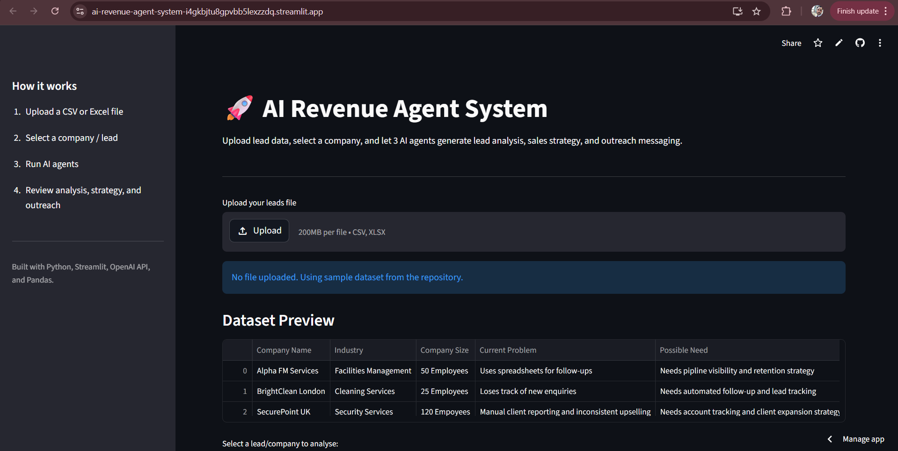
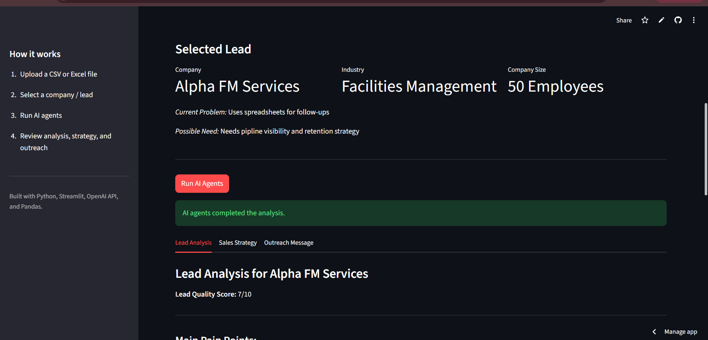
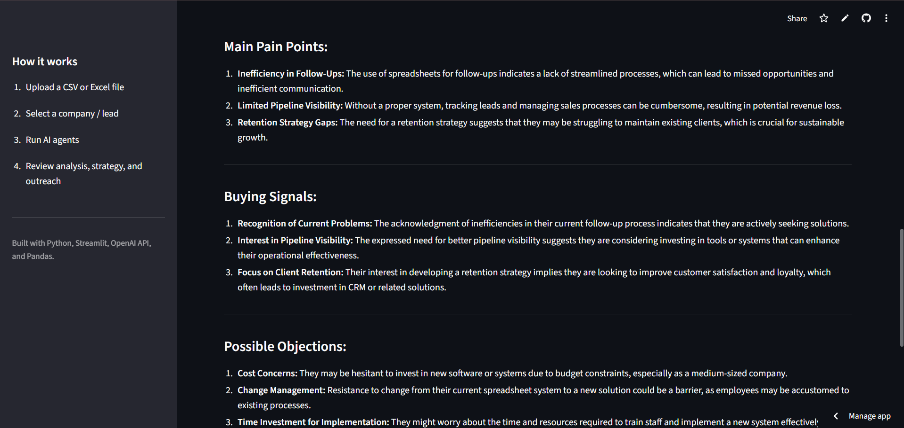
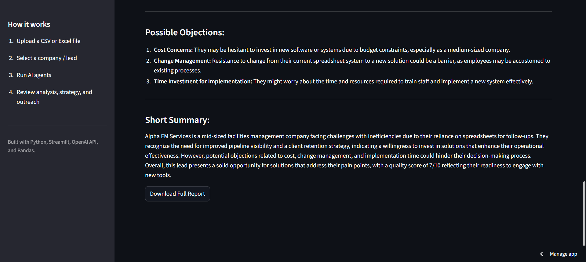

# 🚀 AI Revenue Agent System

An AI-powered decision system that simulates a real-world B2B sales workflow using intelligent agents.

🔗 **Live Demo:**  
https://ai-revenue-agent-system-i4gkbjtu8gpvbb5lexzzdq.streamlit.app/

---

## 🔎 Project Positioning

This project is designed as an AI-powered decision system for B2B sales workflows.

Rather than functioning as a static dashboard or generic chatbot, the platform simulates a multi-agent commercial workflow where AI agents analyse leads, generate sales strategies, and recommend next-best actions.

The goal is to demonstrate how AI can support practical business decision-making across revenue and growth teams.

---

## 🎯 What This System Does

This system simulates a real-world B2B sales workflow using AI agents.

Instead of static dashboards, it enables:

- Intelligent lead qualification  
- Automated sales strategy generation  
- Context-aware outreach messaging  

It transforms raw data into *decision-ready actions*.

---

## ⚙️ How It Works

The system simulates 3 AI Agents working together:

### 1. Lead Analyst
- Evaluates lead quality
- Identifies pain points
- Detects buying signals
- Highlights objections

### 2. Sales Strategist
- Builds a practical B2B sales approach
- Defines value proposition
- Suggests engagement strategy
- Recommends next best action

### 3. Outreach Writer
- Generates a professional outreach message
- Human, concise, and non-pushy
- Ready for LinkedIn or email

---

## 🖥️ Demo Workflow

1. Upload a dataset (CSV or Excel)
2. Preview the data instantly
3. Select a company/lead
4. Run AI Agents
5. Receive:
   - Lead Analysis
   - Sales Strategy
   - Outreach Message

---

## 🌐 Live Demo Experience

Try the live system here:

🔗 https://ai-revenue-agent-system-i4gkbjtu8gpvbb5lexzzdq.streamlit.app/

You can:
- Use the built-in sample dataset  
- Select different companies  
- Generate real-time AI-driven insights  

No setup required.

---

## 📊 Example Use Case

Input:
- Facilities management company
- Uses spreadsheets for lead tracking
- Needs pipeline visibility & faster follow-ups

Output:
- Lead score and insights
- Tailored sales strategy
- Personalised outreach message

---

## 🧠 Why This Matters

Most businesses rely on:
- Static dashboards
- Manual decision-making
- Slow sales workflows

This project shows a shift towards:

AI as a decision engine, not just a reporting tool.

This reflects the shift from passive analytics to active decision intelligence —  
where systems not only present data, but recommend actions.

---

## 🛠️ Tech Stack

- Python
- Streamlit
- OpenAI API
- Pandas

---

## 📸 Screenshots

### Dashboard and Dataset Preview

### Selected Lead

### AI Analysis Output

### Download Report Feature

---

## 🚀 How to Run Locally

git clone https://github.com/kamranafridi9220-prog/ai-revenue-agent-system.git  
cd ai-revenue-agent-system  
pip install -r requirements.txt  
streamlit run app.py  

---

## 🔐 API Configuration

This project requires an OpenAI API key.

Create a `.env` file in the root directory and add:

OPENAI_API_KEY=your_api_key_here

Without this, the AI agents will not run.

---

## 🧠 System Architecture

The system uses a multi-agent approach:

1. Lead Analyst Agent  
   → Evaluates lead quality, pain points, and buying signals  

2. Sales Strategist Agent  
   → Builds a tailored go-to-market approach  

3. Outreach Agent  
   → Generates human-like B2B messaging  

Each agent builds on the previous output, simulating real decision workflows.

---

## 🧩 Workflow Architecture

Dataset Upload → Lead Selection → Lead Analyst Agent → Sales Strategist Agent → Outreach Writer Agent → Downloadable Sales Report

This workflow demonstrates a multi-step AI decision pipeline where each agent contributes specialised reasoning to the final business recommendation.

---

## 💼 Business Impact

This system demonstrates how AI can:

- Reduce manual lead qualification effort  
- Improve sales targeting and conversion rates  
- Enable scalable, data-driven decision-making  
- Replace fragmented workflows with unified intelligence  

Applicable across:
Sales teams, SMEs, consulting firms, and growth-focused organisations.

---

## ⚠️ Limitations

- Outputs depend on input data quality  
- AI responses may vary due to probabilistic nature  
- Not connected to real CRM systems (simulation environment)  
- Requires API key for full functionality  

This project is designed as a decision-support prototype.

---

## 🏗️ Production Roadmap

Future enterprise-ready enhancements could include:

- CRM integration with HubSpot and Salesforce
- Persistent lead memory and interaction history
- Real-time lead enrichment APIs
- Vector search for similar lead matching
- Multi-user collaboration features
- API deployment for enterprise workflows
- Autonomous follow-up orchestration

---

## 🔮 Future Improvements

- CRM integrations (HubSpot / Salesforce)
- Real-time lead enrichment
- Multi-agent orchestration (CrewAI version)
- API deployment for business use
- Automated outreach sending

---

## 📌 Current Status

Version: v1.0  
Status: Live and functional  

Actively being improved with additional AI capabilities and integrations.

---

## 🎯 Project Purpose

This project is part of a broader initiative to build:

AI-driven business decision systems for sales and revenue teams.

It demonstrates practical application of:
- AI agents
- Sales intelligence
- Automation in decision-making

---

## 👤 Author

Kamran Khan  
Business Intelligence | AI Decision Systems | Sales Analytics  
London, UK

---

## ⭐ If you found this useful

Give it a star ⭐ and connect with me on LinkedIn.
